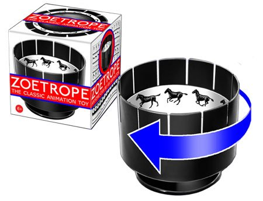
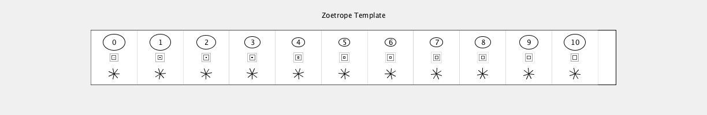
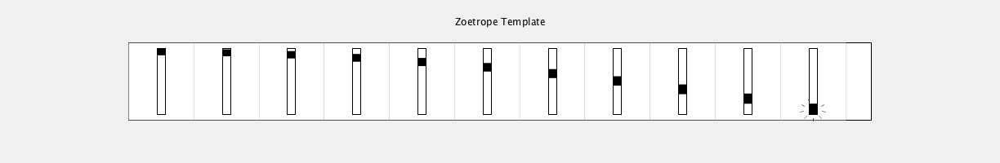

# ZoetropeTemplate
Template for Zoetrope toy by Eye Think
Developed for Processing 3.3.6 / 23 January 2018 by Golan Levin 

Zoetropes are available from: 
* https://www.amazon.com/Zoetrope-Animation-Toy-Victorian-Illusion/dp/B007VM9HZO/

It is anticipated that students will customize the code in the "drawArtFrame()" function in ZoetropeTemplate.pde with their own design. No other code needs to be modified. Pressing 'p' exports a PDF. Cut out the design and put it on your zoetrope. Fun!

Also see this repository for a Praxinoscope: https://github.com/golanlevin/PraxinoscopeTemplate/

